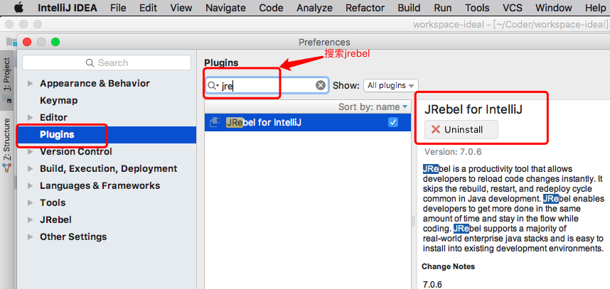
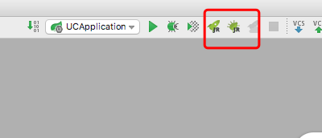
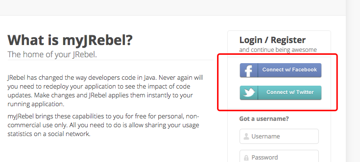
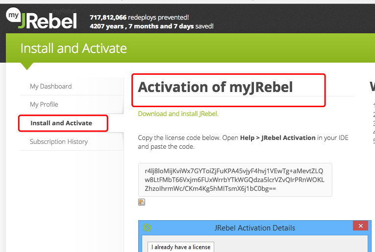
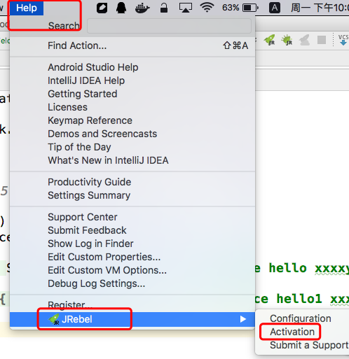
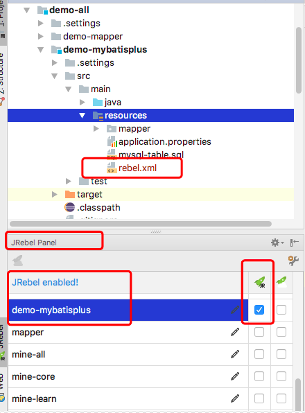
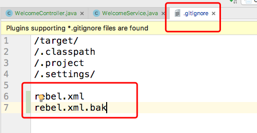
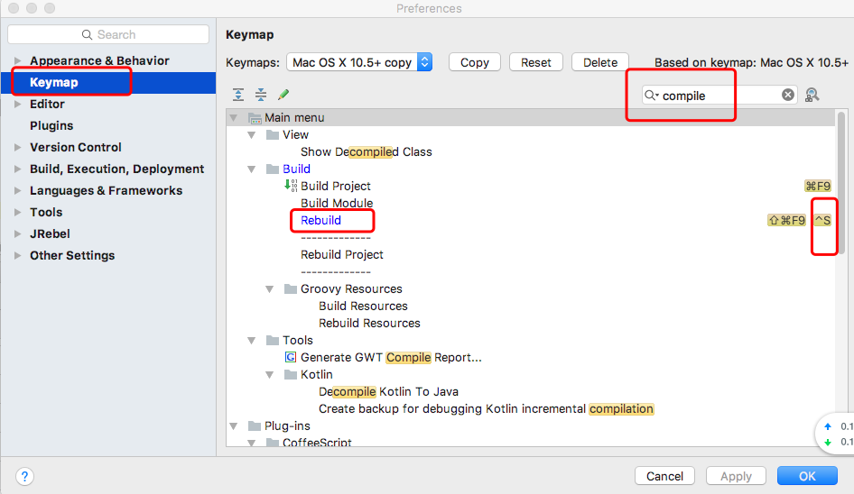
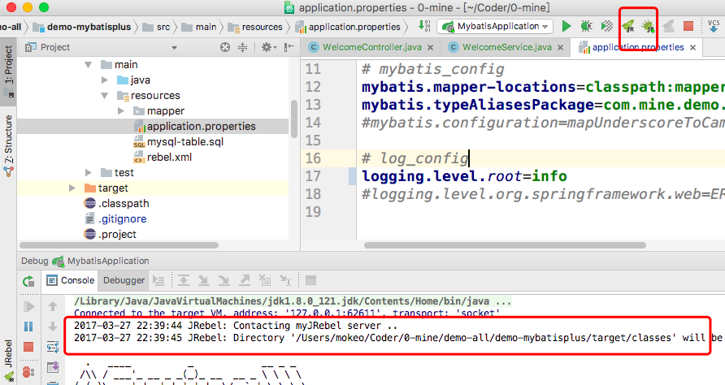

# spring-boot + ideal + jrebel应用自动reload方案
## 背景
一直都琢磨着，想拥有这样的功能：对于即时修改的代码，无需重启应用程序，便能自动reload changes；以减少因重启应用花费的时间，提升程序开发效率。  
曾经花费了一些时间尝试过修改代码的reload相关方案，包括`spring-reloaded`、`spring-boot-devtools`；但使用下来，结果并不理想。一直也知道，在reload方案中jrebel是最好的机制，但需要收费，也就没有过多的去关注。对于代码修改自动reload也就成为了自个心中的一个梗，悬而未解；我相信对于有问题解决强迫症的同学来说，这是很不爽的。  
今天因为做一个东西，又激起了自身折腾的兴致，决定重新尝试下，把这个悬而未解的问题拿下。在花费了一些时间之后，总算是有所收获，达到了自己想要的效果。  
所使用的方式：基于`jrebel`，这货收费果然是有道理的，下面就讲一下具体实现步骤。

## 环境
自己当前的开发环境： `MacOS` + `spring-boot` + `intellij ideal`

## 具体步骤
1. 在intellij ideal中，安装jrebel插件  

2. 安装成功后，需要重启，效果图。图中所框图标，为jrebel方式run、debug启动  

3. 这时候的jrebel是没有进行注册的，需要进行注册。
  * 访问https://my.jrebel.com/，可能需要翻墙，下面的操作也是。至于翻墙手段，可以使用[lantern](https://github.com/getlantern/lantern)。
  * 通过facebook或twitter账户登录注册就可以获得免费的激活码  
   
  * 如果你已有facebook或twitter，那就直接登录；如果没有，那就注册一个吧
  * 注册facebook，直接使用手机号进行注册。因使用邮箱的facebook还是需要手机号确认，才能注册生效的
  * my.jrebel登录成功后，需要填写一些信息，那就随便填吧
  * 成功后，会有免费的注册码了
  
  * copy该注册码到jrebel激活界面去吧
  
4. 进行jrebel配置，对需要启动的应用程序勾选，enable change ,会在对应的resouces目录增加rebel.xml。该文件并非源代码，考虑加入至`.gitignore`文件中  

5. tips：因ideal源文件是自动保存的，需要手动build之后，才能将修改的文件进行编译。不像在eclipse里边，`ctrl+s`保存之后就会自动重新build。这里可以自行设置一个快捷键，在修改后使用方便的快捷键重新build。对于MacOS，直接设置`ctrl+s`就OK了。

6. 如果有如下打印信息，则证明设置生效，后面就自行体验jrebel的reload神奇吧

## jrebel reload的范围
* 方法内部代码的修改
* 增加新的方法，也不需要restart
* controller增加新的requestMapping
* 代理类逻辑的变更，也是不需要重启的
* 定义新的static变量，成员变量都是可以reload
